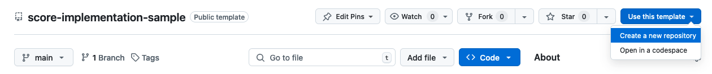

# score-implementation-sample

This score-implementation-sample is a template repo for creating a new Score implementation following the conventions laid out in [Score Compose](https://github.com/score-spec/score-compose) and [Score K8s](https://github.com/score-spec/score-k8s).

This sample comes complete with:

1. CLI skeleton including `init` and`generate` subcommands
    - `generate --overrides-file` and `generate --override-property` for applying Score overrides before conversion
    - `generate --image` for overriding the workload image before conversion.
    - Full placeholder support for `${metadata...}` and `${resource...}` expressions in the workload variables, files, and resource params.
2. State directory storage in `.score-implementation-sample/`
3. `TODO` in place of resource provisioning and workload conversion

To adapt this for your target platform, you should:

1. Fork the repo or use the "use as template" button in Github (this flattens the commit history)
    
2. Rename the go module by replacing all instances of `github.com/score-spec/score-implementation-sample` with your own module name.
3. Replace all other instances of `score-implementation-sample` with your own `score-xyz` name including renaming the `cmd/score-implementation-sample` directory.
4. Run the tests with `go test -v ./...`.
5. Change the `TODO` in [provisioning.go](./internal/provisioners/provisioning.go) to provision resources and set the resource outputs. The existing implementation resolves placeholders in the resource params but does not set any resource outputs.
6. Change the `TODO` in [convert.go](./internal/convert/convert.go) to convert workloads into the target manifest form. The existing implementation resolves placeholders in the variables and files sections but just returns the workload spec as yaml content in the manifests.

Good luck, and have fun!

## Demo

Write the following to `score.yaml`:

```yaml
apiVersion: score.dev/v1b1
metadata:
    name: example
containers:
    main:
        image: stefanprodan/podinfo
        variables:
            key: value
            dynamic: ${metadata.name}
        files:
        - target: /somefile
          content: |
            ${metadata.name}
resources:
    thing:
        type: something
        params:
          x: ${metadata.name}
```

And run:

```sh
go run ./cmd/score-xyz init
go run ./cmd/score-xyz generate score.yaml
```

The output `manifests.yaml` contains the following which indicates:

1. Resources were "provisioned" and their parameters interpolated.
2. Workloads were converted by copying them to the output manifests with variables or files interpolated as required.

```yaml
apiVersion: score.dev/v1b1
metadata:
    name: example
containers:
    main:
        files:
            - content: |
                example
              noExpand: true
              target: /somefile
        image: stefanprodan/podinfo
        variables:
            dynamic: example
            key: value
resources:
    thing:
        params:
            x: example
        type: something
```

## A note on licensing

Most code files here retain the Apache licence header since they were copied or adapted from the reference `score-compose` which is Apache licensed. Any modifications to these files should retain the Apache licence and attribution.
