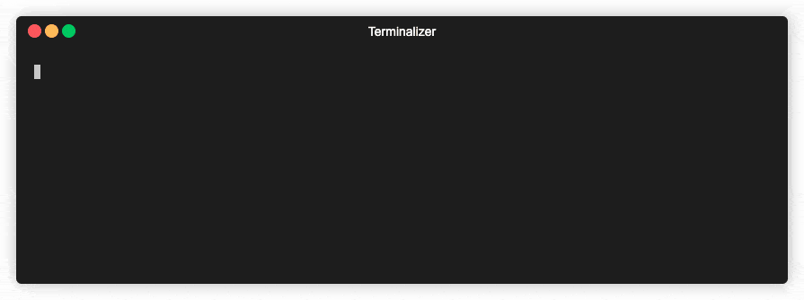
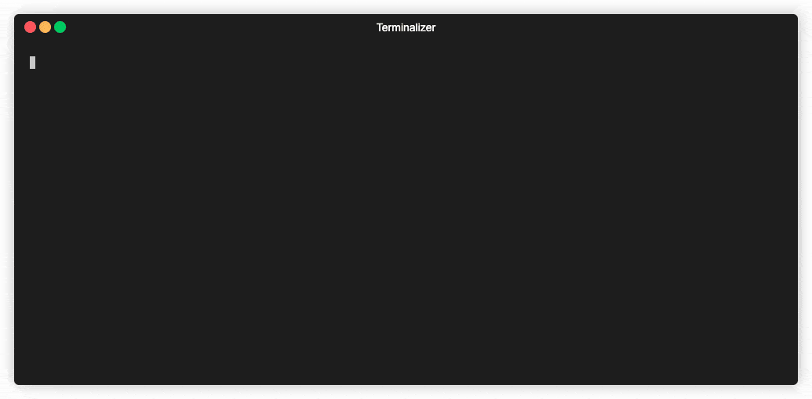

# score-flyio


A [Score](https://docs.score.dev/docs/) v1b1 transformer for [Fly.io](https://fly.io/). Convert your Score application files into Fly.io apps!

Score is a platform-agnostic Workload specification to improve developer productivity and experience. Score allows you to specify the workload once and deploy the same specification to many platforms.

This CLI will transform a Score specification into a Fly.io App which can be deployed.

## Usage

Installation options:

1. Curl and shell: `curl https://raw.githubusercontent.com/astromechza/score-flyio/main/install.sh | sh`
2. Go build the latest release locally: `go install github.com/astromechza/score-flyio@latest`
3. Homebrew (TODO)



```
$ score-flyio --help
Usage: score-flyio [global options...] <subcommand> ...

Available subcommands:
  run	Convert the input Score file into a Fly.io toml file.
  
Global options:
  -debug
    	Enable debug logging

Use "score-flyio" <subcommand> --help for more information about a given subcommand.
```

The `run` command will validate and transform the Score file into a Fly.io App Configuration (`fly.toml`) which can then be deployed.

```
$ score-flyio run --help
Usage: score-flyio [global options...] run [options...] <my-score-file.yaml>

The run subcommand converts the Score spec into a Fly.io app toml and outputs it on the standard output.

Options:
  -app string
    	The target Fly.io app name otherwise the name of the Score workload will be used
  -extension value
    	An extension in the generated TOML to apply, as json separated by a =
  -extensions string
    	A YAML file containing a list of extensions to apply to the generated TOML [{"path": string, "set": any, "delete": bool}]
  -region string
    	The target Fly.io region name otherwise the region will be assigned when you deploy
```

```
FLY_APP_NAME=score-flyio-1234
$ fly app create ${FLY_APP_NAME}
$ score-flyio run --app ${FLY_APP_NAME} examples/01-hello-world.score.yaml > fly.toml
$ fly deploy
```



Note that it still requires volumes to be created manually if required.

## Supported Score Features

- [X] `metadata`
- [X] `container`
  - [X] `image` (**NOTE:** all containers must use the same image)
  - [X] `command`
  - [X] `args`
  - [X] `variables` (**NOTE:** environment variables will be merged and shared between containers)
  - 🗒️️ `files`
    - [X] `target`
    - [ ] `mode` (⚠️ not supported)
    - [X] `content`
    - [X] `source`
    - [X] `noExpand`
  - 🗒️ `volumes`
    - [X] `source`
    - [X] `target`
    - [ ] `path` (⚠️ not supported)
    - [ ] `read_only` (⚠️ not supported)
  - 🗒️ `resources` (**NOTE:** uses `limits` and falls back to `requests`)
    - [X] `limits`
    - [X] `requests`
  - [X] `livenessProbe`
  - [X] `readinessProbe`
- [X] `resources`
  - [X] `metadata`
  - [X] `type`
  - [X] `class`
- 🗒️ `service` (**NOTE**: if multiple containers are set, this will link to the first container)
  - [X] `port`
  - [X] `protocol`
  - [X] `targetPort`

NOTE: that for any Fly.io features not directly supported by Score, you can use the `--extensions` to add in missing
configuration.

### Supported Resource Types

The supported resource types are:

- `environment` - For accessing local environment variables. Properties can be used for accessing environment variables like `${resources.env.SOME_KEY}`.
- `dns` - For accessing a useful hostname of the deployment. The only available property is `host`, a hostname. The default class will return `<app>.internal`, while the `external` class will return the external hostname.
  - **NOTE:** The `external` class depends on a shared-ipv4 address being provisioned for the app.
- `volume` - For specifying the Fly.io volume name via the `metadata.annotations.score-flyio/volume_name` annotation. It can be referenced via `${resources.vol-name}`.
  
  ```yaml
  resources:
    data-volume:
      type: volume
      metadata:
        annotations:
          score-flyio/volume_name: "my_data_volume"
  ```

### Metadata Interpolation

Environment Variables and File contents may interpolate values from the metadata section via `${metadata.<key>}`.

### Resource Interpolation

Properties from declared resources can be accessed via `${resources.<name>.<property>}`.

## Extensions

Once the Score spec has been converted into a Machine Config payload (see https://fly.io/docs/machines/working-with-machines/#the-machine-config-object-properties and https://docs.machines.dev/swagger/index.html#/Machines/Machines_create),
Fly.io specific extensions can be applied. The extensions can be specified as a separate YAML/JSON file (see `--extensions`) or individually on the command line through the `--extention=path=value` syntax.

The extensions are applied by https://github.com/tidwall/sjson, so that `path` specifies a location to modify.

Extension file content:

```yaml
- path: services.0.ports.0.port
  set: 443
- path: services.0.ports.0.handlers
  set: ["tls", "http"]
- path: env.EXTERNAL_SCHEMA
  delete: true
```

Extension command line to set a value: `--extension 'env={"key":"value"}'`.

Extension command line to delete a value: `--extension 'env.key=`.
